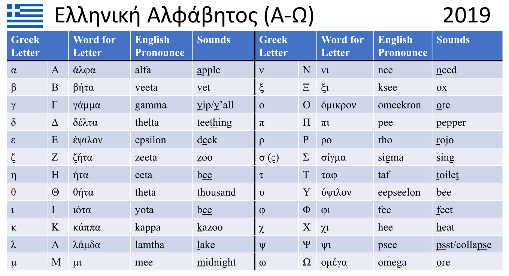
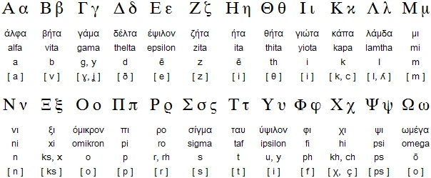
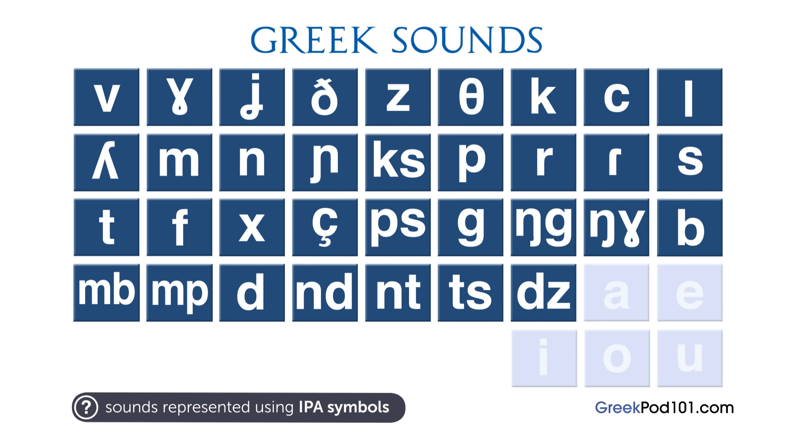
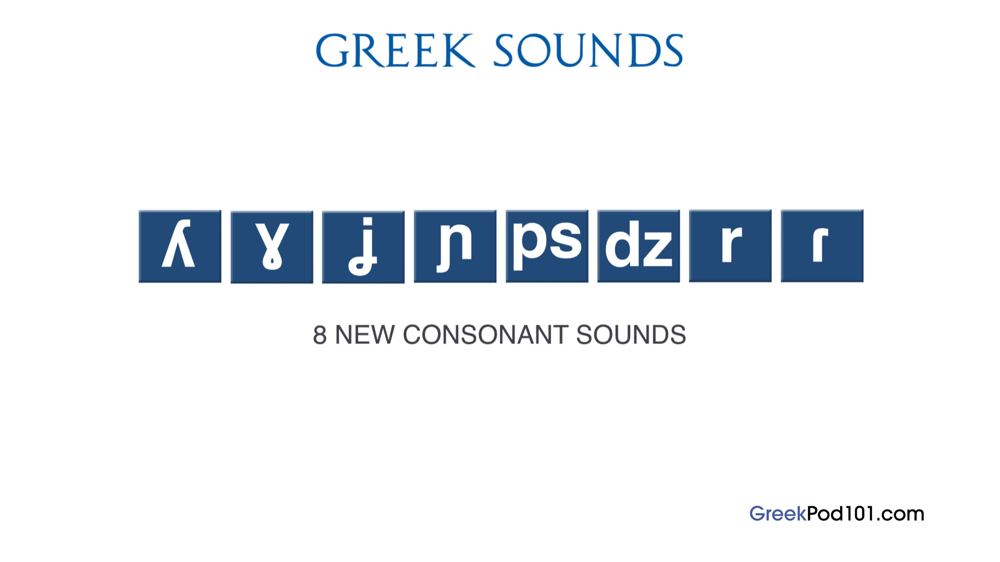

# awesome greek 🕶️

A curated repository of resources for learning Greek.

## Greek Alphabet
ΑΒΓΔΕΖΗΘΙΚΛΜΝΞΟΠΡΣΤΥΦΧΨΩ
αβγδεζηθικλμνξοπρστυφχψω

### YouTube Videos

* [Greek alphabet the CORRECT pronunciation](https://www.youtube.com/watch?v=28yu1PFc438)
* [Learn The Modern Greek Alphabet | Omilo](https://www.youtube.com/watch?v=RQF6dZZqX5I)
* [ABC song for Greek alphabet](https://www.youtube.com/watch?v=YVq3587vT6s)
* [Greek Alphabet Learn Greek Lesson 1](https://www.youtube.com/watch?v=4U6876EZff0)
* [Modern Greek Lessons: Greek Alphabet](https://www.youtube.com/watch?v=vLoeAYL2-qc)
* [Learning the Greek alphabet - an introduction to the Script Hacking method - Judith Meyer | PG 2019](https://www.youtube.com/watch?v=nHA2DEYVJR0)

### Books

* [Greek Script Hacking: The optimal pathway to learn the Greek alphabet (Teach Yourself)](https://www.amazon.com/Greek-Script-Hacking-optimal-alphabet/dp/1473679826)

### Pictures (with English Pronunciation)

### Typing
Interactive website to learn to type in Greek:
https://www.typingstudy.com/en-greek-3/lesson/1

## Greek Sounds

34 consonant sounds and 5 vowel sounds.

26 consonant sounds shared by English.

### Websites

* [Interactive IPA Chart](https://www.ipachart.com/)
* [IPA Reader](http://ipa-reader.xyz/)
* [Greek Phonology - The Sound of Greek](http://greek.kanlis.com/phonology.html)
* [Toward a Phonological Grammar of Modern Spoken Greek - Luigi Romeo](https://www.tandfonline.com/doi/pdf/10.1080/00437956.1964.11659851)
* [Speak Greek - Phonetic Library](http://speakgreek.web.auth.gr/dp/en/library/choose)
* [Modern Greek phonology](https://en.wikipedia.org/wiki/Modern_Greek_phonology)
* [Help:IPA/Greek](https://en.wikipedia.org/wiki/Help:IPA/Greek)
* [How to Learn a Language’s Sound System with Anki](https://blog.fluent-forever.com/how-to-learn-pronunciation-anki/)

### YouTube Videos

* [Introduction to Perfect Greek Pronunciation](https://www.youtube.com/watch?v=TqzemlAVn6g)
* [Introduction to Greek Pronunciation](https://www.youtube.com/watch?v=PtsWZ8HvEuI)
* [Pronunciation Tutorial 1: English Pronunciation and IPA: Voicing and Place](https://www.youtube.com/watch?v=-e66ByetpDY)
* [Pronunciation Tutorial 2: English Pronunciation and IPA: Manner](https://www.youtube.com/watch?v=jJR1VPzayu0)
* [Pronunciation Tutorial 3: English Vowels and the International Phonetic Alphabet](https://www.youtube.com/watch?v=eeaghqkLRi8)
* [Ask a Greek Teacher - When Do You Use ι, η, υ, ει, οι and υι?](https://www.youtube.com/watch?v=W16WCeM0yes)

### Vowels

|IPA|Spellings|
|---|---------|
|[ä](https://en.wikipedia.org/wiki/Open_central_unrounded_vowel)|Α|
|[e̞](https://en.wikipedia.org/wiki/Mid_front_unrounded_vowel)|Ε ΑΙ|
|[i](https://en.wikipedia.org/wiki/Close_front_unrounded_vowel)|Η Ι Υ ΟΙ ΕΙ ΥΙ|
|[o](https://en.wikipedia.org/wiki/Close-mid_back_rounded_vowel)|Ο Ω|
|[u](https://en.wikipedia.org/wiki/Close_back_rounded_vowel)|ΟΥ|

#### YouTube Videos

* [Learn Greek: How to Pronounce the Vowels Correctly | Τα φωνήεντα](https://www.youtube.com/watch?v=Zb7r9kJODTw)
* [Greek Pronunciation - Greek Vowels](https://www.youtube.com/watch?v=Xql6qZ3lpUo)
* [Greek Online Lessons | A1 | Phonology - Double Vowels (part 1)](https://www.youtube.com/watch?v=WIWiD51a5VI)
* [Greek Online Lessons | A1 | Phonology - Double Vowels (part 2)](https://www.youtube.com/watch?v=pNFHIpFFYBY)

### Vowel Combinations

αυ (/af/ unvoiced) + π τ κ φ θ σ χ

αυ (/av/ voiced) + vowel or μπ ντ β δ γ ζ μ ν λ ρ

ευ (/ef/ unvoiced) + π τ κ φ θ σ χ

ευ (/ev/ voiced) + vowel or μπ ντ β δ γ ζ μ ν λ ρ

An accent mark on the first vowel denotes the pair of vowel letters are pronounced separately.
άυλος

A [diaeresis](https://en.wikipedia.org/wiki/Greek_diacritics) appears on the letters ι and υ to show that a pair of vowel letters is pronounced separately, rather than as a diphthong.
καταπραϋντικός

#### YouTube Videos

* [Learn Greek: Grammar & Pronunciation | The Vowel Combinations αυ & ευ](https://www.youtube.com/watch?v=iza1WvQV554)

### Consonants
Β Γ Δ Ζ Θ

|IPA|Name|Simliar To|Sample Words|
|---|----|----------|------------|
|[ɣ](https://www.youtube.com/watch?v=Xz9Q38rmXi0)|[voiced dorsal velar non sibilant fricative](https://www.youtube.com/watch?v=MmGjJNGTuIs)|g k|γάλα γωνία γουρούνι γη γένος γηγενής|
|ɾ|[voiced apical alveolar tap](https://www.youtube.com/watch?v=J0IYx-WGebg)||ρήμα αρένα έρανος|
|r|[voiced apical alveolar trill](https://www.youtube.com/watch?v=uguCSUaA45k)||τρίζω κράζω πρόβα|
|ʎ|[voiced dorsal palatal lateral tap](https://www.youtube.com/watch?v=V8iyYPJL200)|l|ελιά λιοπύρι γελιέμαι|
|ɲ|[voiced front dorsal palatal nasal stop](https://www.youtube.com/watch?v=N0NIZNgVKaY)||νιότη νοιάζομαι πενιές|
|ʝ|[voiced dorsal palatal non sibilant fricative](https://www.youtube.com/watch?v=jXY5wj56kQY)||αγέρας γείσο γερνώ|
|ps||||
|dz||||

*See [How to Pronounce Greek Like a Native Speaker](https://www.youtube.com/watch?v=G_iQkFMHNiM)*.

#### YouTube Videos

* [Learn Greek: The Consonants Pronunciation | Part1: Β Γ Δ Ζ Θ](https://www.youtube.com/watch?v=J-K2PjifH0Q)
* [Learn Greek: The Consonants Pronunciation | Part2: Κ Λ Μ Ν Ξ Π](https://www.youtube.com/watch?v=04BgJPL12cA)
* [Learn Greek: The Consonants Pronunciation | Part 3: Ρ Σ Τ Φ Χ Ψ](https://www.youtube.com/watch?v=-CwN-k-URks)
* [Learn Greek: The Consonants Pronunciation | Part4: Consonant Combinations ΜΠ ΝΤ ΓΚ ΓΓ ΤΣ ΤΖ](https://www.youtube.com/watch?v=c08rv3JK3n4)
* [How to Pronounce Greek Like a Native Speaker](https://www.youtube.com/watch?v=G_iQkFMHNiM)

## Greek Vocabularly

* [Anki: Vocabulary of Cortina Modern Greek](https://ankiweb.net/shared/info/880833658)
* [Memrise: Beginner Greek - FULL AUDIO](https://app.memrise.com/course/358276/beginner-greek-full-audio/)

## Greek Grammar

### YouTube Videos

* [Learn Greek: Grammar | Τα μέρη του λόγου - Parts of Speech](https://www.youtube.com/watch?v=_ump7AqGJoQ)

## Websites

* https://www.duolingo.com/
* https://app.memrise.com/courses/english/greek/
* http://www.xanthi.ilsp.gr/filog/default.htm
* http://www.kypros.org/LearnGreek/
* http://greek.pgeorgalas.gr/Default.asp

## Tutors

* [Preply: St. Louis, MO Greek Tutors](https://preply.com/en/St-Louis-MO/greek-tutors)

## Audio Courses

* [Complete Greek - Language Transfer](https://www.languagetransfer.org/greek)

## Articles

* [How to Learn Any Language in Record Time and Never Forget It](https://tim.blog/2014/07/16/how-to-learn-any-language-in-record-time-and-never-forget-it/)
