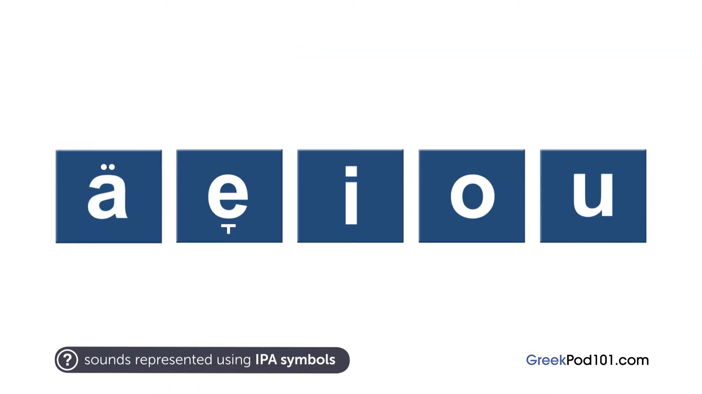

# awesome greek 🕶️

A curated repository of resources for learning Greek.

## Greek Alphabet
ΑΒΓΔΕΖΗΘΙΚΛΜΝΞΟΠΡΣΤΥΦΧΨΩ
αβγδεζηθικλμνξοπρστυφχψω

### YouTube Videos

* [Greek alphabet the CORRECT pronunciation](https://www.youtube.com/watch?v=28yu1PFc438)
* [Learn The Modern Greek Alphabet | Omilo](https://www.youtube.com/watch?v=RQF6dZZqX5I)
* [ABC song for Greek alphabet](https://www.youtube.com/watch?v=YVq3587vT6s)
* [Greek Alphabet Learn Greek Lesson 1](https://www.youtube.com/watch?v=4U6876EZff0)
* [Modern Greek Lessons: Greek Alphabet](https://www.youtube.com/watch?v=vLoeAYL2-qc)
* [Learning the Greek alphabet - an introduction to the Script Hacking method - Judith Meyer | PG 2019](https://www.youtube.com/watch?v=nHA2DEYVJR0)

### Books

* [Greek Script Hacking: The optimal pathway to learn the Greek alphabet (Teach Yourself)](https://www.amazon.com/Greek-Script-Hacking-optimal-alphabet/dp/1473679826)

### Pictures (with English Pronunciation)

### Typing
Interactive website to learn to type in Greek:
https://www.typingstudy.com/en-greek-3/lesson/1

## Greek Sounds

34 consonant sounds and 5 vowel sounds.

26 consonant sounds shared by English.

### Websites

* [Interactive IPA Chart](https://www.ipachart.com/)
* [IPA Reader](http://ipa-reader.xyz/)
* [Greek Phonology - The Sound of Greek](http://greek.kanlis.com/phonology.html)
* [Toward a Phonological Grammar of Modern Spoken Greek - Luigi Romeo](https://www.tandfonline.com/doi/pdf/10.1080/00437956.1964.11659851)
* [Speak Greek - Phonetic Library](http://speakgreek.web.auth.gr/dp/en/library/choose)
* [Modern Greek phonology](https://en.wikipedia.org/wiki/Modern_Greek_phonology)
* [Help:IPA/Greek](https://en.wikipedia.org/wiki/Help:IPA/Greek)
* [Appendix:Greek_pronunciation](https://en.wiktionary.org/wiki/Appendix:Greek_pronunciation)
* [How to Learn a Language’s Sound System with Anki](https://blog.fluent-forever.com/how-to-learn-pronunciation-anki/)

### YouTube Videos

* [Introduction to Perfect Greek Pronunciation](https://www.youtube.com/watch?v=TqzemlAVn6g)
* [Introduction to Greek Pronunciation](https://www.youtube.com/watch?v=PtsWZ8HvEuI)
* [Pronunciation Tutorial 1: English Pronunciation and IPA: Voicing and Place](https://www.youtube.com/watch?v=-e66ByetpDY)
* [Pronunciation Tutorial 2: English Pronunciation and IPA: Manner](https://www.youtube.com/watch?v=jJR1VPzayu0)
* [Pronunciation Tutorial 3: English Vowels and the International Phonetic Alphabet](https://www.youtube.com/watch?v=eeaghqkLRi8)
* [Ask a Greek Teacher - When Do You Use ι, η, υ, ει, οι and υι?](https://www.youtube.com/watch?v=W16WCeM0yes)

### Vowels

|IPA|Spellings|
|---|---------|
|[ä](https://en.wikipedia.org/wiki/Open_central_unrounded_vowel)|Α|
|[e̞](https://en.wikipedia.org/wiki/Mid_front_unrounded_vowel)|Ε ΑΙ|
|[i](https://en.wikipedia.org/wiki/Close_front_unrounded_vowel)|Η Ι Υ ΟΙ ΕΙ ΥΙ|
|[o](https://en.wikipedia.org/wiki/Close-mid_back_rounded_vowel)|Ο Ω|
|[u](https://en.wikipedia.org/wiki/Close_back_rounded_vowel)|ΟΥ|

#### YouTube Videos

* [Learn Greek: How to Pronounce the Vowels Correctly | Τα φωνήεντα](https://www.youtube.com/watch?v=Zb7r9kJODTw)
* [Greek Pronunciation - Greek Vowels](https://www.youtube.com/watch?v=Xql6qZ3lpUo)
* [Greek Online Lessons | A1 | Phonology - Double Vowels (part 1)](https://www.youtube.com/watch?v=WIWiD51a5VI)
* [Greek Online Lessons | A1 | Phonology - Double Vowels (part 2)](https://www.youtube.com/watch?v=pNFHIpFFYBY)

### Double Vowel Combinations

The following double vowel combinations:

1. αυ /av/ /af/
2. ευ /ev/ /ef/
3. ηυ /iv/ /if/

are pronounced with a voiced (/v/) sound or unvoiced (/f/) sound depending upon 3 factors:

1. accentuation
2. on the letter that follows
3. and on their position within a word.

The double vowel combinations may be pronounced separately if:
1. an accent mark is on the first vowel (e.g. άυλος).
2. or a [diaeresis](https://en.wikipedia.org/wiki/Greek_diacritics) appears on the second vowel (e.g. καταπραϋντικός).

If neither vowel is accented, or the second vowel is accented, then the following rules apply:

* /av/ /ev/ and /iv/ (voiced) when:
    * followed by a vowel or voiced consonant sound (μπ ντ γγ γκ τζ β δ γ ζ μ ν λ ρ)
* /af/ /ef/ and /if/ (unvoiced) when:
    * followed by ξ (x), ψ (ps), or an unvoiced consonant sound (κ π τ χ φ θ σ & τσ)
    * or the double vowel is at the end of a word.

When the /ev/ sound comes before a /v/ sound, and the /ef/ sound comes before another /f/ sound, the /v/ of /f/ sound is not pronounced twice or longer. It is only pronounced once (e.g. εύβοια and ευφυής).

#### YouTube Videos

* [Learn Greek: Grammar & Pronunciation | The Vowel Combinations αυ & ευ](https://www.youtube.com/watch?v=iza1WvQV554)
* [How Do You Correctly Pronounce αυ, ευ, and ηυ?](https://www.youtube.com/watch?v=azO2-4fMahY)

### Consonants
Β Γ Δ Ζ Θ

|IPA|Name|Simliar To|Sample Words|
|---|----|----------|------------|
|[ɣ](https://www.youtube.com/watch?v=Xz9Q38rmXi0)|[voiced dorsal velar non sibilant fricative](https://www.youtube.com/watch?v=MmGjJNGTuIs)|g k|γάλα γωνία γουρούνι γη γένος γηγενής|
|ɾ|[voiced apical alveolar tap](https://www.youtube.com/watch?v=J0IYx-WGebg)||ρήμα αρένα έρανος|
|r|[voiced apical alveolar trill](https://www.youtube.com/watch?v=uguCSUaA45k)||τρίζω κράζω πρόβα|
|ʎ|[voiced dorsal palatal lateral tap](https://www.youtube.com/watch?v=V8iyYPJL200)|l|ελιά λιοπύρι γελιέμαι|
|ɲ|[voiced front dorsal palatal nasal stop](https://www.youtube.com/watch?v=N0NIZNgVKaY)||νιότη νοιάζομαι πενιές|
|ʝ|[voiced dorsal palatal non sibilant fricative](https://www.youtube.com/watch?v=jXY5wj56kQY)||αγέρας γείσο γερνώ|
|ps||||
|dz||||

*See [How to Pronounce Greek Like a Native Speaker](https://www.youtube.com/watch?v=G_iQkFMHNiM)*.

# σ
σ is pronounced /z/ (voiced) instead of /s/ (unvoiced) before a *voiced* consonant (β, γ, δ, λ, ρ, μ, ν).

#### YouTube Videos

* [Learn Greek: The Consonants Pronunciation | Part1: Β Γ Δ Ζ Θ](https://www.youtube.com/watch?v=J-K2PjifH0Q)
* [Learn Greek: The Consonants Pronunciation | Part2: Κ Λ Μ Ν Ξ Π](https://www.youtube.com/watch?v=04BgJPL12cA)
* [Learn Greek: The Consonants Pronunciation | Part 3: Ρ Σ Τ Φ Χ Ψ](https://www.youtube.com/watch?v=-CwN-k-URks)
* [Learn Greek: The Consonants Pronunciation | Part4: Consonant Combinations ΜΠ ΝΤ ΓΚ ΓΓ ΤΣ ΤΖ](https://www.youtube.com/watch?v=c08rv3JK3n4)
* [How to Pronounce Greek Like a Native Speaker](https://www.youtube.com/watch?v=G_iQkFMHNiM)

## Greek Vocabularly

* [Anki: Vocabulary of Cortina Modern Greek](https://ankiweb.net/shared/info/880833658)
* [Memrise: Beginner Greek - FULL AUDIO](https://app.memrise.com/course/358276/beginner-greek-full-audio/)

## Greek Grammar

### Parts of Speech

Two main parts:
1. **Inflected** - Modified (mostly their endings) depending upon their position or usage in a sentence.
2. **Non-inflected** - Never change their form.

|Inflected (Κλιτά)|Non-inflected (Άκλιτα)|
|-----------------|----------------------|
|1. άρθρο (article)|7. επίρρλμα (adverb)|
|2. ουσιαστικό (noun)|8. πρόθεση (preposition)|
|3. επίθετο (adjective)|9. σύνδεσμος (conjunction)|
|4. αντωνυμία (pronoun)|10. επιφώνημα (interjection)|
|5. ρήμα (verb)||
|6. μετοχή (participle)||

### Inflection (Declension & Conjugation)

Inflection of articles, nouns, adjectives, pronouns, and passive voice participles is called *declension*.

Inflection of verbs is called *conjugation*.

#### 3 Characteristics of Declension

1. Case
2. Gender
   1. Masculine
   2. Feminine
   3. Neuter
3. Number
   1. Singular
   2. Plural

### 4 Cases

Cases exist in order to indiate relationships among the words of a sentence like the subject, object, and more.

1. Nominative
2. Genitive
3. Accusative
4. Vocative

Direct cases:
1. Nominative
2. Vocative

Oblique cases:
1. Genitive
2. Accusative

#### άρθρο (article)

1. Το οριστικό άρθρο (*the definite article*).
    * ο, η, το

2. το αόριστο άρθρο (*the indefinite article*).
    * ένας, μια, ένα

### YouTube Videos

* [Learn Greek: Grammar | Τα μέρη του λόγου - Parts of Speech](https://www.youtube.com/watch?v=_ump7AqGJoQ)

### Books

* [Essential Modern Greek Grammar](https://www.amazon.com/Essential-Modern-Grammar-Language-Guides/dp/0486251330)
* [Greek: An Essential Grammar](https://www.amazon.com/Greek-Essential-Grammar-Routledge-Grammars/dp/1138930687/)

### Websites

* https://www.greekgrammar.eu/
* https://www.lingq.com/en/grammar-resource/greek/

## Articles

* [Wikipedia - Modern Greek grammar](https://en.wikipedia.org/wiki/Modern_Greek_grammar)

## Websites

* https://www.duolingo.com/
* https://app.memrise.com/courses/english/greek/
* http://www.xanthi.ilsp.gr/filog/default.htm
* http://www.kypros.org/LearnGreek/
* http://greek.pgeorgalas.gr/Default.asp

## Tutors

* [Preply: St. Louis, MO Greek Tutors](https://preply.com/en/St-Louis-MO/greek-tutors)

## Audio Courses

* [Complete Greek - Language Transfer](https://www.languagetransfer.org/greek)

## Articles

* [How to Learn Any Language in Record Time and Never Forget It](https://tim.blog/2014/07/16/how-to-learn-any-language-in-record-time-and-never-forget-it/)

## Common Greek Proficiency Test

The [Certificate of Attainment in Greek](https://stephanus.tlg.uci.edu/CAG/utility.html) is the only officially recognized certificate that confirms the knowledge of Greek as a second language. It offers a professional opinion of one’s knowledge of Greek, and serves as proof of the level of attainment in Greek in the work market.

## Greek Radio

* [https://www.e-radio.gr/](https://www.e-radio.gr/)
* [https://www.ert.gr/](https://www.ert.gr/)

## YouTube Channels

* [greek lessons online](https://www.youtube.com/c/greeklessonsonlinevideos/featured)
* [Learn Greek with Lina](https://www.youtube.com/c/linaaaap1/featured)
* [Learn Greek with GreekPod101.com](https://www.youtube.com/c/greekpod101/featured)
* [Helinika - Greek Language, History & Culture](https://www.youtube.com/channel/UCfm2XWQPXHtjN9ptZrjxwuQ/featured)
* [Omilo Greek Language and Culture](https://www.youtube.com/c/OmiloHellas/featured)
* [Miss Ruby](https://www.youtube.com/c/MissRuby/featured)
* [Learn Greek with Zoi](https://www.youtube.com/channel/UCq1cHTQko_diWLd2LnuZZ_A/featured)
* [Easy Greek](https://www.youtube.com/c/EasyGreekVideos/featured)
* [Ρίτα Κουκουλάκη](https://www.youtube.com/channel/UCxQUJp_kaU8UnNw9Z7ROekQ/featured)

## Courses

* [Greek for you A1](https://ellinognosia.com/courses/greek-for-you-a1/)

## Books

* [General Secretariat for Lifelong Learning](http://www.gsae.edu.gr/en/)
  * [Greek Language Learning - A1](http://www.gsae.edu.gr/el/ekpaideftiko-yliko/803-a1)
  * [Greek Language Learning - A2](http://www.gsae.edu.gr/el/ekpaideftiko-yliko/804-a2)
  * [Elements of Greek History & Greek Culture](http://www.gsae.edu.gr/el/ekpaideftiko-yliko/805-elliniki-istoria)
* [Modern Greek - Wikibooks](https://en.wikibooks.org/wiki/Modern_Greek)

## Articles

* [Wikipedia - Modern Greek](https://en.wikipedia.org/wiki/Modern_Greek)

## YouTube Videos

* [Fluent Forever Anki tutorials](https://www.youtube.com/playlist?list=PL6iffsHU8hUkLHWIm-OmNc4uUwuiFlFq-)
  * [Fluent Forever Book: The Gallery](https://blog.fluent-forever.com/gallery/)

## Open Courses

* [Open Courses - National Technical University of Athens (Εθνικό Μετσόβιο Πολυτεχνείο)](https://ocw.aoc.ntua.gr/modules/course_metadata/opencourses.php?fc=42)
    * [Wind Energy - Video Lesson (Αιολική Ενέργεια - Βιντεομάθημα)](https://ocw.aoc.ntua.gr/courses/MECH108/)
    * [Air elasticity with application to wind turbines (Αεροελαστικότητα με εφαρμογή σε ανεμογεννήτριες)](https://ocw.aoc.ntua.gr/courses/MECH117/)

## [Comprehensible Input](https://en.wikipedia.org/wiki/Input_hypothesis)

* [Knowledge as a Common. Communities of production and sharing in Greece](https://www.youtube.com/watch?v=8iCZgZEYm0w)
