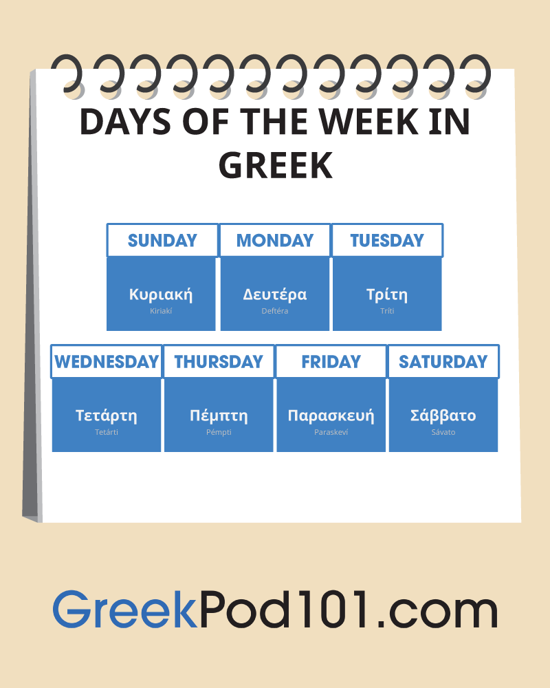

# Days of Week

|English|Greek|Romanization|
|-------|-----|------------|
|Sunday|Κυριακή|Kiriakí|
|Monday|Δευτέρα|Deftéra|
|Tuesday|Τρίτη|Tríti|
|Wednesday|Τετάρτη|Tetárti|
|Thursday|Πέμπτη|Pémpti|
|Friday|Παρασκευή|Paraskeví|
|Saturday|Σάββατο|Sávato|

