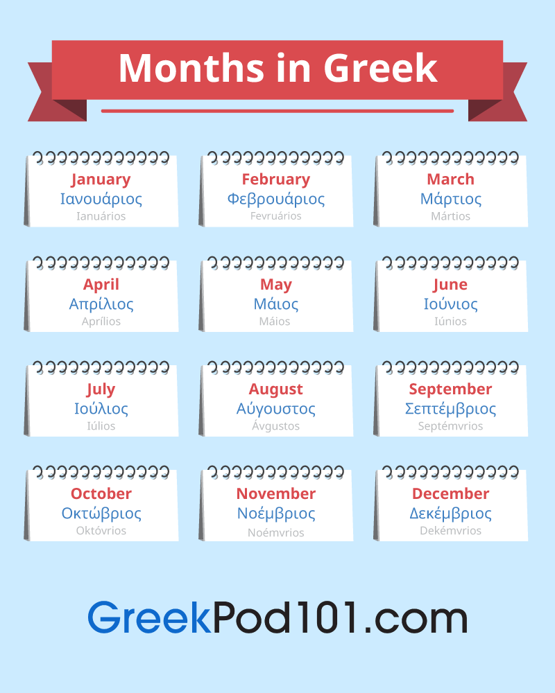

# YouTube: Greek to English Vocabulary Cheat-Sheet

A vocabulary cheat-sheet for translating Greek to English for YouTube.

## Primary
|Greek|English|
|-----|-------|
|Αναζήτηση|Search|

---

## Left-hand Sidebar

|Greek|English|
|-----|-------|
|Αρχική σελ.|Home|Home Page|
|Εξερεύνηση|Explore|
|Εγγραφές|Subscriptions|
|Βιβλιοθήκη|Library|
|Ιστορικό|History|
|Βίντεο που σας αρέσουν|Your videos|
|Παρακολούθηση αργότερα|Watch later|
|Εμφάνιση άλλων|Show more|
|Εμφάνιση λιγότερων|Show less|

---

## Videos

|Greek|English|
|-----|-------|
|χίλια (χίλ.)|thousand|
|εκατομμύριο (εκ.)|million|
|προβολές|views|
|και άλλοι|and others|
|Μου αρέσει|I like|
|Εγγραφή|Subscribe|
|Κοινοποίηση|Share|
|Αποθήκευση|Save|
|Αναφορά|Report|
|Προσθέστε ένα δημόσιο σχόλιο…|Add a public comment...|
|Άκυρο|Cancel|
|Σχόλιο|Comment|
|Σίγαση|Mute|
|Υπότιτλοι|Subtitles|
|Νέο|New|

---

## Time

|Greek|English|
|-----|-------|
|πριν από 7 μήνες|7 months ago|
|έτος|year|
|έτη|years|
|μήνα|month|
|μήνες|months|
|εβδομάδες|weeks|
|εβδομάδα|week|
|ημέρα|day|
|ημέρες|days|
|ώρες|hours|
|ώρα|hour|
|λεπτό|minute|
|λεπτά|minutes|
|δεύτερος|second|
|δευτερόλεπτα|seconds|
|προ μεσημβρίας (πμ)|before noon|
|μετά μεσημβρίας (πμ)|after noon|

## Months
|Greek|English|
|-----|-------|
|Ιανουάριος (Ιαν)|January (Jan)|
|Φεβρουάριος (Φεβ)|February (Feb)|
|Μάρτιος|March (Mar)|
|Απρίλιος (Απρ)|April (Apr)|
|Ενδέχεται|May|
|Ιούνιος (Ιουν)|June (Jun)|
|Ιούλιος (Ιουλ)|July (Jul)|
|Αύγουστος|August (Aug)|
|Σεπτέμβριος|September (Sep)|
|Οκτώβριος (Οκτ)|October (Oct)|
|Νοέμβριος (Νοε)|November (Nov)|
|Δεκέμβριος|December (Dec)|

## Settings

|Greek|English|
|-----|-------|
|Διαχείριση Λογαριασμού Google|Manage your Google Account|
|Το κανάλι σας|Your channel|
|Αγορές και συνδρομές|Purchases and memberships|
|Εναλλαγή λογαριασμών|Switch account|
|Αποσύνδεση|Sign out|
|Εμφάνιση: Σκούρο|Appearance: Dark|
|Γλώσσα|Language|
|Τοποθεσία|Location|
|Ρυθμίσεις|Settings|
|Τα δεδομένα σας στο YouTube|Your data in YouTube|
|Βοήθεια|Help|
|Αποστολή σχολίων|Send feedback|
|Συντομεύσεις πληκτρολογίου|Keyboard shortcuts|
